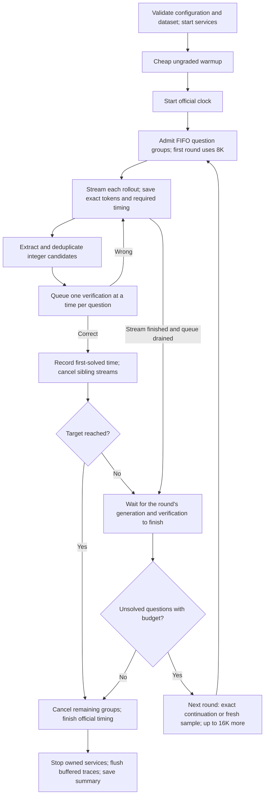

# Usage guide

`qed` is the only command; run it from any working directory (attempts are saved to
`./attempts/`, override with `QED_HOME`).

| Command | Does | Needs |
| --- | --- | --- |
| `qed [flags]` | Runs a policy on a real GPU and saves an attempt | NVIDIA GPU, vLLM, model weights, a dataset |
| `qed --simulate [flags]` | The same run against a mocked inference backend ([Simulation](#simulation)) | Nothing but the install |
| `qed view [--attempts DIR]` | Browses saved attempts in a local web viewer | Nothing but the install |
| `qed fetch-data --year Y` | Downloads the AIME benchmark files | `pip install -e '.[data]'`, network |
| `qed sim-config [--sim ...]` | Prints a resolved `--simulate` configuration | Nothing |

`python -m qed` is equivalent to `qed`. For installation see the [README](../README.md#install).

## Model weights and launch profiles

(Real runs only; `--simulate` needs neither weights nor a profile.) The runner serves the model itself. Place weights in `MODELS_DIR/<org>/<name>/`
(default `~/models`, `--models-dir`) and it resolves the launch profile
`MODELS_DIR/<org>/<name>/<profile>` (`--model-profile`, default
`vllm-flashinfer.yaml`). If that file does not exist, the **bundled** profile of the
same name under `profiles/models/<org>/<name>/` is used, with its `model:` path
pointed at `MODELS_DIR/<org>/<name>`; the materialized copy is saved in the attempt
as `vllm_profile.yaml`. Bundled profiles: the reference NVFP4 model
(`r0b0tlab/VibeThinker-3B-NVFP4`), plus v1.6 profiles for it, AWQ and BF16 variants.
For any other model, write a vLLM YAML profile (`served-model-name` must equal
`--model`; the server must stream token IDs and accept token-ID prompts for exact
continuations) and drop it in the weights directory.

vLLM and the grader's dependencies are taken from the interpreter running the
command; use `--vllm-python`, `--vllm-binary` and `--grader-python` to point
elsewhere (e.g. a separate vLLM virtualenv).

## Tuning knobs

Explicit CLI flags override the selected preset. The default
`presets/prompt_adherence.json` selects AIME 2025, 30×1, an 8K first request,
16K subsequent requests, a four-request ceiling per question, and a target of 18.

| Flag | Default | Controls |
| --- | --- | --- |
| `--parallelism` | 30 | Concurrent question groups |
| `--rollouts` | 1 | Concurrent samples per question group |
| `--first-pass-max-tokens` | 8192 | Output budget per initial request |
| `--max-tokens` | 16384 | Additional output budget per subsequent request, clipped to remaining context |
| `--max-attempts-per-question` | 4 | Total generation requests, including continuations; v1 permits at most four |
| `--max-rounds` | 4 | Maximum number of coverage rounds |
| `--schedule` | `barrier` | Wait for a round to finish, or use `eager` retries |
| `--no-continuation` | Off | Start fresh samples instead of continuing capped trajectories |
| `--temperature`, `--top-p` | 0.8, 0.95 | Sampling |
| `--seed` | 20261003 | Base seed for recorded per-request seed assignment |
| `--target-correct` | 18 | Stop after this many distinct correct verdicts |
| `--questions` | All | Select question indices from the configured dataset |
| `--system-prompt-file` | Improved v1 prompt | Replace the system prompt |
| `--preset` | `presets/prompt_adherence.json` | Load a reusable configuration; explicit flags take precedence |
| `--model` | `r0b0tlab/VibeThinker-3B-NVFP4` | Requested served model ID |
| `--models-dir`, `--model-profile` | `~/models`, `vllm-flashinfer.yaml` | Locate the model launch profile |
| `--grader-cost` | 3.0 | Seconds charged per verification; keep fixed when comparing runs |
| `--question-timeout` | 1800 | Timeout in seconds for each question group's generation and verification |
| `--profile` | Off | Enable optional CPU, engine and GPU observations; retain buffered trace writes |
| `--benchmark` | On through the preset | Disable optional profiling and buffer required traces until official timing ends |
| `--version` | `v1` | Policy: `v1`, `v1.6`, `naive` ([policies](../src/qed/extensions/README.md)) |
| `--simulate`, `--sim`, `--sim-config` | Off | Mock the inference backend; see [Simulation](#simulation) |

For example, configure two initial samples with 4K each:

```bash
qed \
  --parallelism 30 --rollouts 2 \
  --first-pass-max-tokens 4096 --max-tokens 16384 \
  --seed 20261011
```

This is a configuration example, not a measured speedup. Initial concurrency is
approximately `parallelism × rollouts`. Every sample consumes the per-question
request budget: **four initial rollouts leave no continuation budget**. With two
initial rollouts and the four-request limit, at most two further requests remain.

GPU memory utilization, total context length, and server-wide generation limits
are configured in the **vLLM YAML profile**, not these CLI token flags. That profile
is resolved at `MODELS_DIR/MODEL/MODEL_PROFILE`. Request budgets must fit its
generation ceiling; exact continuations are also clipped to remaining total
context. The reference profile uses 95% GPU memory and 64K total context.

Use `--vllm-python`, `--vllm-binary`, and `--grader-python` for other Python/runtime
locations; `--vllm-port` and `--grader-port` change service ports. Run
`qed --help` for all options, or `qed --version v1.6 --help` (or `naive`) for that
policy's flags; each has its own defaults and presets.

## Policy and timing

| Default | Behavior |
| --- | --- |
| Question parallelism / fan-out | 30 question groups, one stream per group |
| Generation budget | First request: 8,192 output tokens; subsequent requests: up to 16,384 additional tokens |
| Per-question ceiling | Four generation requests total, including continuations; four rounds |
| Scheduling | FIFO within a round; barrier before the next round |
| Continuation | Resume a capped, unsolved lane from its exact token IDs when context permits; otherwise start fresh |
| Sampling | Temperature 0.8, top-p 0.95; seed = base seed + question index × request ceiling + rollout number |
| Extraction | Completed integer boxes, complete answer lines, and supported literal answer clauses; values 0–999 |
| Verification | Candidate deduplication across the question's rounds; one in-flight check per question; shared FIFO grader, 3s/check |
| Stop | 18 distinct questions verified, or request/round budgets exhausted |
| Warmup | At most 30 arithmetic requests, 32 output tokens each; no grader queries |



A wrong answer does not interrupt v1 reasoning or inject feedback. A round barrier
includes pending verification, not just generation. A capped request reserves no
live KV slot after completion; exact-prefix continuation can benefit from prefix
caching but does not guarantee a cache hit. Four requests means the initial request
plus at most three further requests. Grader checks have a separate, uncapped budget.

First-solved timestamps are recorded immediately on a positive grader response,
before stream cleanup. `time_to_target_s` is the target-th distinct first-solved
time. Its monotonic start is after questions are loaded, services are ready,
inference warmup has finished, and configuration is saved, immediately before
scheduling solving requests. `--benchmark` changes profiling/storage, not dataset
loading order or the timer boundary. Official latency also includes cancellation
settlement. Service cleanup and the final buffered trace flush are outside official
timing. A completed attempt
can have `target_reached: false`; inspect both fields when comparing runs.

## Datasets

The built-in AIME 2024/2025/2026 sets are selected with `--benchmark-year`
(default 2025). They are licensed upstream (CC BY-NC-SA 4.0) and not bundled:
fetch them once into `$QED_DATA` (default `~/.cache/qed`).
The downloader resolves each source at its pinned revision and verifies hashes:

```bash
pip install -e '.[data]'
qed fetch-data --year 2025                   # repeat --year for more
qed --questions 1 2 3 --target-correct 2 --parallelism 3
```


For your own questions, keep gold answers in the grader, not the solver. Create a
JSONL file with `problem_idx`, `problem` and `answer`:

```jsonl
{"problem_idx":4,"problem":"What is 12 multiplied by 13?","answer":156}
{"problem_idx":90,"problem":"Sum the integers from 1 through 10.","answer":55}
```

Point a grader YAML at it (a relative `source` is read relative to the YAML file) and
launch with an integer-answer prompt:

```yaml
dataset:
  source: questions.jsonl      # next to this YAML, or an absolute path
  format: jsonl
  idx_field: problem_idx
  problem_field: problem
  gold_field: answer
  id: my_dataset
```

```bash
qed \
  --grader-config grader.yaml \
  --system-prompt-file src/qed/examples/integer_prompt.txt \
  --parallelism 2 --target-correct 2
```

A complete two-question example ships in `src/qed/examples/`.
The solver receives only question indices and statements from the grader's
gold-free `GET /questions` endpoint; the attempt saves their fingerprint and a
`questions.json` snapshot. `--reuse-grader` attaches to a fresh dedicated
questions-capable grader on `--grader-port` (it must report zero previous queries
and the requested toll) and leaves it running. `--dataset-manifest FILE` accepts a
pinned JSON manifest with prompt/key paths and hashes (see `lib/datasets.py`).

**v1 extracts only integers from 0 through 999 inclusive.** Fractions, symbolic
expressions and other answer formats are outside its extraction contract; the
grader itself (MathArena parser) can compare general expressions, so a new policy
extension with a different extractor is the way to support them.

## Configuration, profiling, and evidence

```bash
# Reproduce the selected policy with a different declared seed.
qed --preset src/qed/presets/prompt_adherence.json --seed 20261012

# Original prompt control, with the same scheduling/budgets.
qed --preset src/qed/presets/baseline.json

# Enable optional CPU, event-loop, engine and GPU sampling.
qed --profile

# Help for a separately versioned policy.
qed --version v1.6 --help
```

The default `--benchmark` preset disables optional profiling and NVML sampling,
buffers required JSON/JSONL evidence in RAM, and flushes after official timing.
VRAM and engine observations are unavailable in that mode. `--profile` enables
those observations while retaining buffered writes. `--buffer-traces` alone is
available for custom presets; `--benchmark-prewarm` is an optional ungraded AIME
2024 workload (fetch `--year 2024` first), but the default retains the cheaper warmup. Graceful interruption
saves partial evidence; a hard kill can lose buffered traces.

Each attempt records `config.json`, `model_profile.json`, `questions.json`,
`summary.json`, `metadata.json`, and `solved.jsonl`. Under `trace/NN/`, the runner
saves each round's state, verification events, and `rollout-NN/` request, response,
token IDs and telemetry. Telemetry retains start/end timestamps, full generation
latency, TTFT, end-to-end settlement latency and prefix-cache observations when
reported by vLLM. Full streams, service logs and grader audits are large; keep them out of Git.
Use `qed.lib.metadata ATTEMPT_DIRECTORY` to validate metadata.

## Simulation

`--simulate` replaces the inference server and the GPU with a mocked backend that
runs inside the `qed` process. Everything else is the real thing: the policy
scheduler, streaming extraction, deduplication, exact-token continuations, the
toll-gated grader (a real subprocess), traces and the viewer. Use it to develop
and compare policies without a GPU, and to ask how a policy behaves under serving
characteristics you choose.

```bash
# No GPU, no downloaded data: 30 synthetic questions with a random integer key.
qed --simulate --grader-config src/qed/examples/synthetic_grader.yaml \
    --system-prompt-file src/qed/examples/integer_prompt.txt --target-correct 18

# Change the serving model; compare policies under the same knobs.
qed --simulate --version naive --sim decode_tps=60 --sim max_num_seqs=32 ...
qed --simulate --version v1.6 --sim-config my_sim.yaml ...
```

`--sim KEY=VALUE` (repeatable, dotted for `behavior.*`) overrides `--sim-config FILE`
(YAML or JSON), which overrides the defaults; unknown keys are rejected with the list
of valid ones. A run is also real wall-clock time: a 60-second simulated solve takes
60 seconds, against the real grader's 3 s toll.

**Start here.** Zero configuration works. These six knobs cover most experiments:

| To change... | Use |
| --- | --- |
| How fast a stream decodes | `--sim decode_tps=60` |
| How fast prompts are processed (TTFT) | `--sim prefill_tps=4000` |
| How many requests the server runs at once | `--sim max_num_seqs=32` |
| How accurate the model is | `--sim behavior.p_correct=0.5` |
| How long it reasons | `--sim behavior.reasoning_median_tokens=9000` |
| Make every question equally hard (same answer timing) | `--sim behavior.difficulty=uniform` |

Everything else (listed below, and in
[`examples/sim_default.yaml`](../src/qed/examples/sim_default.yaml)) has a default you
can ignore. `qed sim-config [--sim ...]` prints the fully resolved configuration and
what it implies (mean accuracy, mean length, the chance all four samples of a question
are wrong) without running anything.

### Serving knobs

| Knob | Default | Meaning |
| --- | --- | --- |
| `decode_tps` | 100 | Decode tokens/s of **each** running request, independent of load |
| `prefill_tps` | 8000 | Uncached prompt tokens/s of each request; sets TTFT with the queue |
| `max_num_seqs` | 256 | Running sequences; further requests wait FIFO (queue time, `num_requests_waiting`) |
| `stream_interval_tokens` | 8 | Tokens per streamed chunk |
| `prefix_cache`, `block_tokens` | true, 16 | vLLM-style chained block hashes: exact continuations and shared system prompts hit the cache; `reset_prefix_cache` clears it |
| `max_model_len`, `gpu_memory_utilization` | from the launch profile | Context limit and the VRAM fraction |
| `vram_total_mib`, `weights_mib`, `kv_bytes_per_token` | 81920, 2400, 36864 | Size the KV pool; reported in `/metrics`, GPU samples and `simulation.json` |

### The simulated model

| `behavior.` knob | Default | Meaning |
| --- | --- | --- |
| `p_correct` | 0.65 | Chance a sample's final answer equals the answer key |
| `reasoning_median_tokens`, `reasoning_sigma`, `reasoning_min_tokens` | 6000, 0.8, 200 | Lognormal reasoning length |
| `answer_at` | [0.45, 0.95] | Where the answer first appears, as a fraction of the reasoning |
| `p_wrong_first` | 0.15 | Chance of a wrong tentative answer before the final one (the cost of optimism) |
| `final_tokens` | 40 | Final response length after the reasoning |
| `difficulty` | mixed | Per-question difficulty: `mixed`, `uniform`, or a list of tiers (below) |
| `seed`, `answers` | 0, run's own key | Trajectory and tier-assignment seed; JSONL of `problem`/`answer` to use instead |

### Question difficulty

Questions differ in *when* the model first gets an answer, not in how often that
answer is right. `behavior.difficulty` controls the first and leaves `behavior.p_correct`
alone: every question, in every tier, is answered correctly with the same probability.
Each question gets a **tier** once, and its samples draw their reasoning length and
first-answer position from the tier:

- `mixed` (default): easy / medium / hard in the ratio 7:5:3, i.e. 14 / 10 / 6 of 30
  questions. At the defaults the typical first answer appears around token 1.4K / 4.6K /
  10.4K: easy questions are short and answer early in them, hard ones are long and
  answer late. The preset is relative to the flat knobs: `reasoning_median_tokens` stays
  the overall typical length (tier lengths are scaled so the weighted mean matches) and
  `answer_at` is the medium window, shifted 0.15 earlier for easy and later for hard.
  This is what makes early extraction pay off unevenly: it saves a lot on long hard
  trajectories and little on short easy ones.
- `uniform`: one tier equal to the flat knobs: every question alike.
- A list, for full control. A tier needs a `weight` and may override any of
  `p_correct`, `reasoning_median_tokens`, `reasoning_sigma`, `answer_at`,
  `p_wrong_first` with absolute values; whatever it leaves out comes from the flat
  knobs, and weights are normalized. Overriding `p_correct` in a tier is allowed if you
  do want accuracy to vary with difficulty; the presets never do:

  ```yaml
  behavior:
    difficulty:
      - {name: easy, weight: 3, reasoning_median_tokens: 2500, answer_at: [0.2, 0.6]}
      - {name: hard, weight: 1, reasoning_median_tokens: 12000, answer_at: [0.7, 0.98]}
  ```

A tier belongs to the question, not the sample or the run: questions are ranked by a
hash of `behavior.seed` and their text and cut into blocks sized by the weights (largest
remainder), so 30 questions at 7:5:3 are exactly 14/10/6, a question keeps its tier
whichever subset you run, and every policy sees the same hard questions.
`simulation.json` lists which `problem_idx` fell in each tier. `qed sim-config` shows
the resolved tiers, their typical first-answer positions, and the share of questions
solvable within four samples. With accuracy constant that is 1 - (1 - p)^4 (0.985 at
the default), so a target like 18 of 30 stays comfortably reachable.

### Trajectories

Each request gets a deterministic trajectory from its request seed: filler
reasoning with answers planted in the forms the real extractor recognises (a closed
box, an `Answer:` line, an "answer is N" clause), then a final response ending in a
box. Capped requests finish with `length`; continuing from the exact token IDs
resumes the same trajectory, so v1's continuations, v1.6's long continuation and
naive's final-only extraction all see realistic behavior. The backend implements
chat/completions streaming with `return_token_ids` and continuous usage (including
cached tokens), `/tokenize`, `/v1/models`, `/metrics` (the gauges and counters the
profiler scrapes) and `/reset_prefix_cache`. With `--profile`, GPU samples report
the preallocated VRAM (vLLM reserves its pool) and 100% utilization while any
sequence runs. `simulation.json` in the attempt records requests, tokens, peak
running/waiting sequences, queue/prefill/decode seconds, prefix-cache hit fraction
and KV usage.

### What a simulated result is not

- **Not a hardware measurement.** Attempts are tagged: `config.json` has
  `simulated: true` and the resolved knobs, metadata carries a `simulation` block
  and `gpu.device: simulated`, the viewer labels them, and they never share a
  cluster or comparison family with real attempts.
- **Load-independent rates.** Every request decodes at `decode_tps` however many
  are running, so concurrency never slows decoding and contention appears only as
  `max_num_seqs` queueing. Naive's 120-stream fan-out is therefore flattered.
- **The model is given the answer key** to sample correct answers (from
  `--grader-config`, the fetched AIME file, or `behavior.answers`). The solver side
  stays gold-free; only the mock "knows" what a model of that accuracy would say.
  AIME needs `qed fetch-data`; `--reuse-grader` needs `behavior.answers`.
- **In process.** The simulator shares the event loop and CPU with the runner, so
  runner-overhead profiling includes simulator work.

### Extending it

`qed.sim.engine.StaticRates` is the extension point: `prefill_seconds` and
`decode_seconds` receive the current load (running sequences, waiting, live tokens).
A finer model replaces it to make decode depend on batch size, memory bandwidth and
arithmetic intensity, GPU profiles or kernel utilization, and `Engine.generate` is
where KV-capacity admission and preemption would go. The transport, scripted model,
runner and recording do not change.

## Package layout

```text
src/qed/
  cli.py, config.py       Public entrypoint and validated configuration
  run.py                  Attempt lifecycle and official clock
  scheduler.py, question.py   V1 round scheduling, candidate queue, verification
  lib/                    Requests, streaming, extraction, continuations,
                          services, datasets, warmup, storage, metrics, metadata
  grader/                 Bundled toll-gated answer-checking oracle (own process)
  data/                   Dataset provenance manifests (data is fetched, not bundled)
  prompts/, presets/, profiles/   Explicit configuration and reference vLLM profiles
  extensions/v1_6/        Versioned policy: coverage barrier, then a shared slot pool
  extensions/naive/       Baseline: complete fan-out, final answers only
  sim/                    --simulate: in-process mock of the vLLM server and GPU
  viewer/                 Browser viewer for saved attempts and aggregate results
  analysis/               Offline plots over saved attempts
  fetch_data.py           Verified benchmark downloader
  manifest.json           Source snapshot (drift is reported, see below)
```

`manifest.json` (and the v1.6 manifest) pin the source of each policy. Drift is a
warning and is flagged in the attempt's config; set `QED_STRICT_INTEGRITY=1`
to make it fatal when reproducing a pinned measurement. After a reviewed behavior
change, regenerate with `python -m qed.tools.pin --write --reason '...'`.
Add new policies under `extensions/<version>/` with their own entrypoint, manifest
and tests, reuse `qed.lib`, register them in `lib/entrypoints.py`,
and never change v1 to add one: the canonical default stays whatever
`CANONICAL` declares. The measured results in the README belong to the original
experiment commits; offline tests establish the plumbing, not a new GPU timing.
