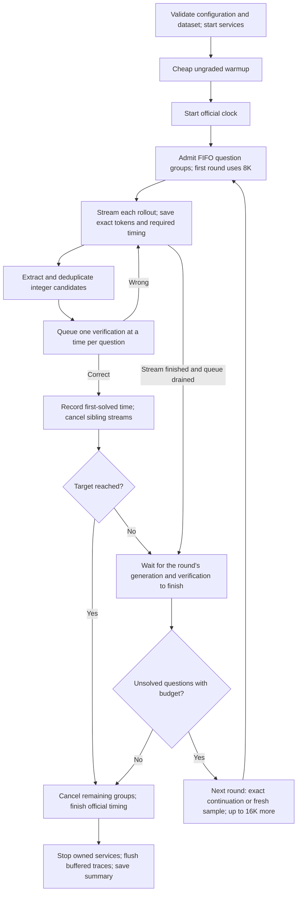

# Usage guide

Everything below uses the installed `reasoning-speedrun` command (equivalently
`python -m reasoning_speedrun`), which is the only CLI: `reasoning-speedrun` runs an
attempt, `reasoning-speedrun view` browses saved attempts and
`reasoning-speedrun fetch-data` downloads the benchmark files. Run it from a working directory of your choice:
attempts are written to `./attempts/` (override with `SPEEDRUN_HOME`). A GPU,
model weights, a vLLM install and the `grader` extra are prerequisites; see
[installation](../README.md#install).

## Model weights and launch profiles

The runner serves the model itself. Place weights in `MODELS_DIR/<org>/<name>/`
(default `~/models`, `--models-dir`) and it resolves the launch profile
`MODELS_DIR/<org>/<name>/<profile>` (`--model-profile`, default
`vllm-flashinfer.yaml`). If that file does not exist, the **bundled** profile of the
same name under `profiles/models/<org>/<name>/` is used, with its `model:` path
pointed at `MODELS_DIR/<org>/<name>`; the materialized copy is saved in the attempt
as `vllm_profile.yaml`. Bundled profiles: the reference NVFP4 model
(`r0b0tlab/VibeThinker-3B-NVFP4`), plus v1.6 profiles for it, AWQ and BF16 variants.
For any other model, write a vLLM YAML profile (`served-model-name` must equal
`--model`; the server must stream token IDs and accept token-ID prompts for exact
continuations) and drop it in the weights directory.

vLLM and the grader's dependencies are taken from the interpreter running the
command; use `--vllm-python`, `--vllm-binary` and `--grader-python` to point
elsewhere (e.g. a separate vLLM virtualenv).

## Tuning knobs

Explicit CLI flags override the selected preset. The default
`presets/prompt_adherence.json` selects AIME 2025, 30×1, an 8K first request,
16K subsequent requests, a four-request ceiling per question, and target18.

| Flag | Default | Controls |
| --- | --- | --- |
| `--parallelism` | 30 | Concurrent question groups |
| `--rollouts` | 1 | Concurrent samples per question group |
| `--first-pass-max-tokens` | 8192 | Output budget per initial request |
| `--max-tokens` | 16384 | Additional output budget per subsequent request, clipped to remaining context |
| `--max-attempts-per-question` | 4 | Total generation requests, including continuations; v1 permits at most four |
| `--max-rounds` | 4 | Maximum number of coverage rounds |
| `--schedule` | `barrier` | Wait for a round to finish, or use `eager` retries |
| `--no-continuation` | Off | Start fresh samples instead of continuing capped trajectories |
| `--temperature`, `--top-p` | 0.8, 0.95 | Sampling |
| `--seed` | 20261003 | Base seed for recorded per-request seed assignment |
| `--target-correct` | 18 | Stop after this many distinct correct verdicts |
| `--questions` | All | Select question indices from the configured dataset |
| `--system-prompt-file` | Improved v1 prompt | Replace the system prompt |
| `--preset` | `presets/prompt_adherence.json` | Load a reusable configuration; explicit flags take precedence |
| `--model` | `r0b0tlab/VibeThinker-3B-NVFP4` | Requested served model ID |
| `--models-dir`, `--model-profile` | `~/models`, `vllm-flashinfer.yaml` | Locate the model launch profile |
| `--grader-cost` | 3.0 | Seconds charged per verification; keep fixed when comparing runs |
| `--question-timeout` | 1800 | Timeout in seconds for each question group's generation and verification |
| `--profile` | Off | Enable optional CPU, engine and GPU observations; retain buffered trace writes |
| `--benchmark` | On through the preset | Disable optional profiling and buffer required traces until official timing ends |

For example, configure two initial samples with 4K each:

```bash
reasoning-speedrun \
  --parallelism 30 --rollouts 2 \
  --first-pass-max-tokens 4096 --max-tokens 16384 \
  --seed 20261011
```

This is a configuration example, not a measured speedup. Initial concurrency is
approximately `parallelism × rollouts`. Every sample consumes the per-question
request budget: **four initial rollouts leave no continuation budget**. With two
initial rollouts and the four-request limit, at most two further requests remain.

GPU memory utilization, total context length, and server-wide generation limits
are configured in the **vLLM YAML profile**, not these CLI token flags. That profile
is resolved at `MODELS_DIR/MODEL/MODEL_PROFILE`. Request budgets must fit its
generation ceiling; exact continuations are also clipped to remaining total
context. The reference profile uses 95% GPU memory and 64K total context.

Use `--vllm-python`, `--vllm-binary`, and `--grader-python` for other Python/runtime
locations; `--vllm-port` and `--grader-port` change service ports. Run
`reasoning-speedrun --help` for all options, or `reasoning-speedrun --version v1.6
--help` for the v1.6 policy's flags; it has its own defaults and presets.

## Policy and timing

| Default | Behavior |
| --- | --- |
| Question parallelism / fan-out | 30 question groups, one stream per group |
| Generation budget | First request: 8,192 output tokens; subsequent requests: up to 16,384 additional tokens |
| Per-question ceiling | Four generation requests total, including continuations; four rounds |
| Scheduling | FIFO within a round; barrier before the next round |
| Continuation | Resume a capped, unsolved lane from its exact token IDs when context permits; otherwise start fresh |
| Sampling | Temperature 0.8, top-p 0.95; seed = base seed + question index × request ceiling + rollout number |
| Extraction | Completed integer boxes, complete answer lines, and supported literal answer clauses; values 0–999 |
| Verification | Candidate deduplication across the question's rounds; one in-flight check per question; shared FIFO grader, 3s/check |
| Stop | 18 distinct questions verified, or request/round budgets exhausted |
| Warmup | At most 30 arithmetic requests, 32 output tokens each; no grader queries |



A wrong answer does not interrupt v1 reasoning or inject feedback. A round barrier
includes pending verification, not just generation. A capped request reserves no
live KV slot after completion; exact-prefix continuation can benefit from prefix
caching but does not guarantee a cache hit. Four requests means the initial request
plus at most three further requests. Grader checks have a separate, uncapped budget.

First-solved timestamps are recorded immediately on a positive grader response,
before stream cleanup. `time_to_target_s` is the target-th distinct first-solved
time. Its monotonic start is after questions are loaded, services are ready,
inference warmup has finished, and configuration is saved, immediately before
scheduling solving requests. `--benchmark` changes profiling/storage, not dataset
loading order or the timer boundary. Official latency also includes cancellation
settlement. Service cleanup and the final buffered trace flush are outside official
timing. A completed attempt
can have `target_reached: false`; inspect both fields when comparing runs.

## Datasets

The built-in AIME 2024/2025/2026 sets are selected with `--benchmark-year`
(default 2025). They are licensed upstream (CC BY-NC-SA 4.0) and not bundled:
fetch them once into `$SPEEDRUN_DATA` (default `~/.cache/reasoning_speedrun`).
The downloader resolves each source at its pinned revision and verifies hashes:

```bash
pip install 'reasoning-speedrun[data]'
reasoning-speedrun fetch-data --year 2025                   # repeat --year for more
reasoning-speedrun --questions 1 2 3 --target-correct 2 --parallelism 3
```


For your own questions, keep gold answers in the grader, not the solver. Create a
JSONL file with `problem_idx`, `problem` and `answer`:

```jsonl
{"problem_idx":4,"problem":"What is 12 multiplied by 13?","answer":156}
{"problem_idx":90,"problem":"Sum the integers from 1 through 10.","answer":55}
```

Point a grader YAML at it (`source` is absolute or relative to the grader's
directory) and launch with an integer-answer prompt:

```yaml
dataset:
  source: /absolute/path/questions.jsonl
  format: jsonl
  idx_field: problem_idx
  problem_field: problem
  gold_field: answer
  id: my_dataset
```

```bash
reasoning-speedrun \
  --grader-config /absolute/path/grader.yaml \
  --system-prompt-file src/reasoning_speedrun/examples/integer_prompt.txt \
  --parallelism 2 --target-correct 2
```

A complete two-question example ships in `src/reasoning_speedrun/examples/`.
The solver receives only question indices and statements from the grader's
gold-free `GET /questions` endpoint; the attempt saves their fingerprint and a
`questions.json` snapshot. `--reuse-grader` attaches to a fresh dedicated
questions-capable grader on `--grader-port` (it must report zero previous queries
and the requested toll) and leaves it running. `--dataset-manifest FILE` accepts a
pinned JSON manifest with prompt/key paths and hashes (see `lib/datasets.py`).

**v1 extracts only integers from 0 through 999 inclusive.** Fractions, symbolic
expressions and other answer formats are outside its extraction contract; the
grader itself (MathArena parser) can compare general expressions, so a new policy
extension with a different extractor is the way to support them.

## Configuration, profiling, and evidence

```bash
# Reproduce the selected policy with a different declared seed.
reasoning-speedrun --preset src/reasoning_speedrun/presets/prompt_adherence.json --seed 20261012

# Original prompt control, with the same scheduling/budgets.
reasoning-speedrun --preset src/reasoning_speedrun/presets/baseline.json

# Enable optional CPU, event-loop, engine and GPU sampling.
reasoning-speedrun --profile

# Help for a separately versioned policy.
reasoning-speedrun --version v1.6 --help
```

The default `--benchmark` preset disables optional profiling and NVML sampling,
buffers required JSON/JSONL evidence in RAM, and flushes after official timing.
VRAM and engine observations are unavailable in that mode. `--profile` enables
those observations while retaining buffered writes. `--buffer-traces` alone is
available for custom presets; `--benchmark-prewarm` is an optional ungraded AIME
2024 workload (fetch `--year 2024` first), but the default retains the cheaper warmup. Graceful interruption
saves partial evidence; a hard kill can lose buffered traces.

Each attempt records `config.json`, `model_profile.json`, `questions.json`,
`summary.json`, `metadata.json`, and `solved.jsonl`. Under `trace/NN/`, the runner
saves each round's state, verification events, and `rollout-NN/` request, response,
token IDs and telemetry. Telemetry retains start/end timestamps, full generation
latency, TTFT, end-to-end settlement latency and prefix-cache observations when
reported by vLLM. Full streams, service logs and grader audits are large; keep them out of Git.
Use `reasoning-speedrun.lib.metadata ATTEMPT_DIRECTORY` to validate metadata.

## Package layout

```text
src/reasoning_speedrun/
  cli.py, config.py       Public entrypoint and validated configuration
  run.py                  Attempt lifecycle and official clock
  scheduler.py, question.py   V1 round scheduling, candidate queue, verification
  lib/                    Requests, streaming, extraction, continuations,
                          services, datasets, warmup, storage, metrics, metadata
  grader/                 Bundled toll-gated answer-checking oracle (own process)
  data/                   Dataset provenance manifests (data is fetched, not bundled)
  prompts/, presets/, profiles/   Explicit configuration and reference vLLM profiles
  extensions/v1_6/        Versioned policy: coverage barrier, then a shared slot pool
  extensions/naive/       Baseline: complete fan-out, final answers only
  viewer/                 Browser viewer for saved attempts and aggregate results
  analysis/               Offline plots over saved attempts
  fetch_data.py           Verified benchmark downloader
  manifest.json           Source snapshot (drift is reported, see below)
```

`manifest.json` (and the v1.6 manifest) pin the source of each policy. Drift is a
warning and is flagged in the attempt's config; set `SPEEDRUN_STRICT_INTEGRITY=1`
to make it fatal when reproducing a pinned measurement. After a reviewed behavior
change, regenerate with `python -m reasoning_speedrun.tools.pin --write --reason '...'`.
Add new policies under `extensions/<version>/` with their own entrypoint, manifest
and tests, reuse `reasoning_speedrun.lib`, register them in `lib/entrypoints.py`,
and never change v1 to add one: the canonical default stays whatever
`CANONICAL` declares. The measured results in the README belong to the original
experiment commits; offline tests establish the plumbing, not a new GPU timing.
